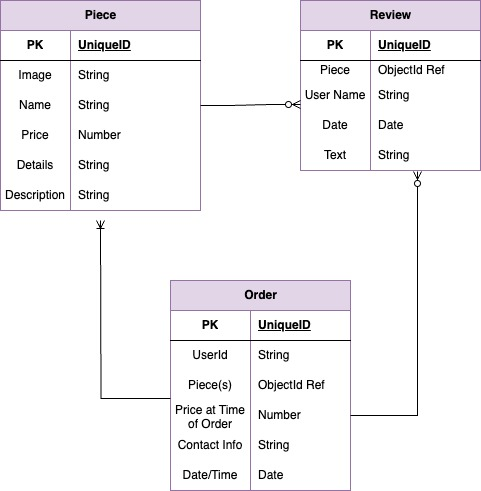
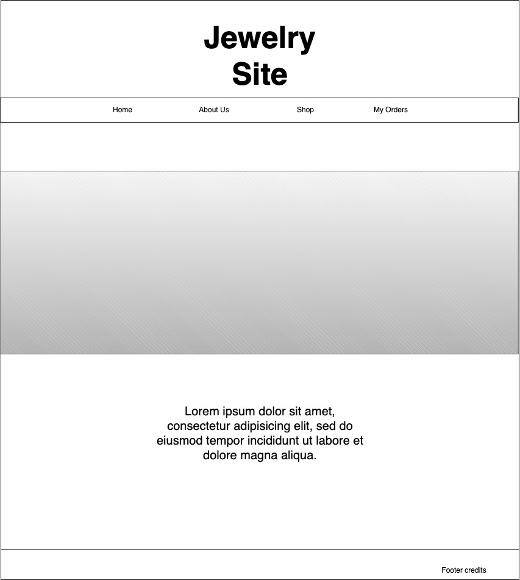
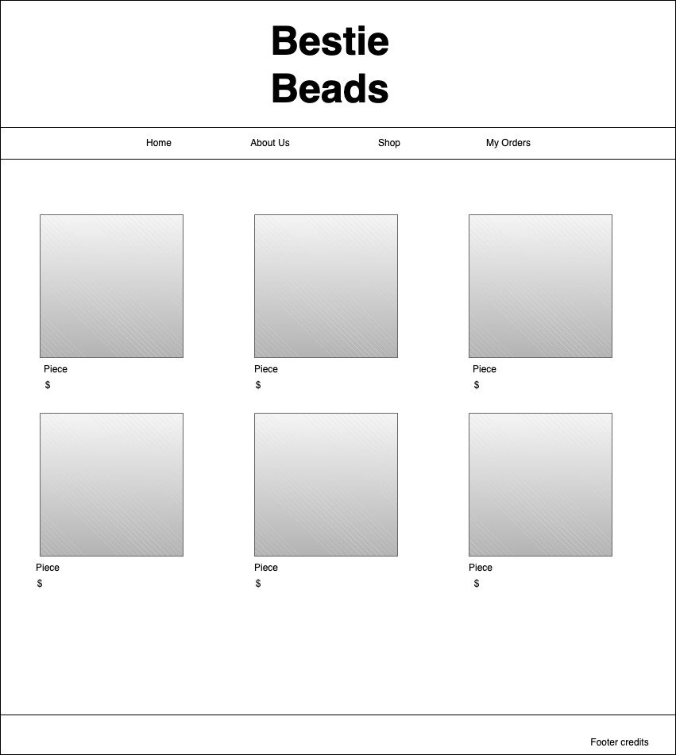
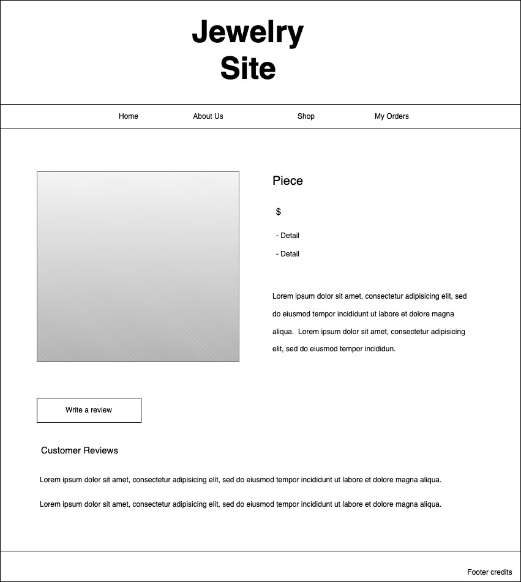
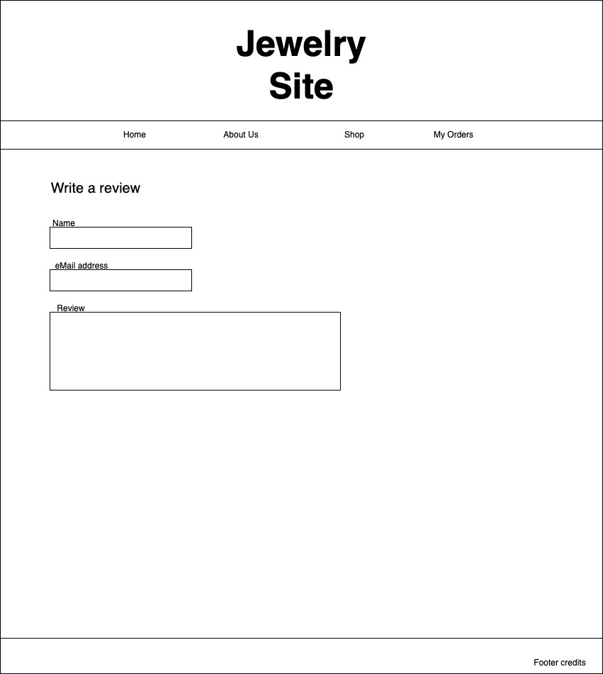
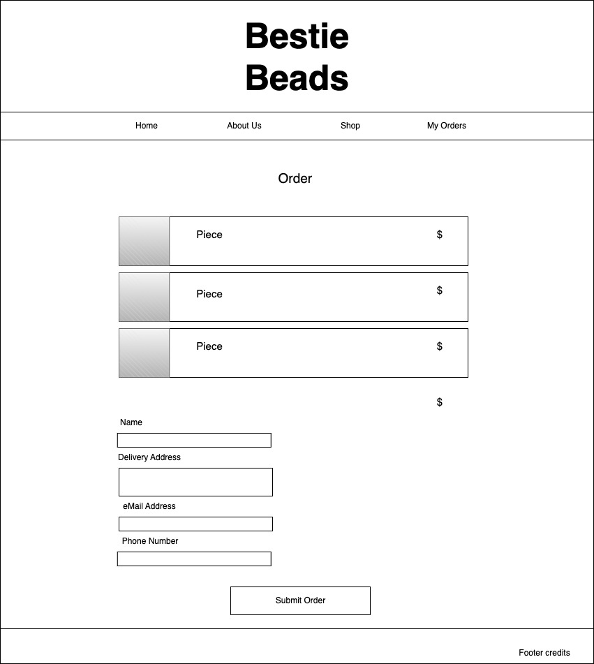
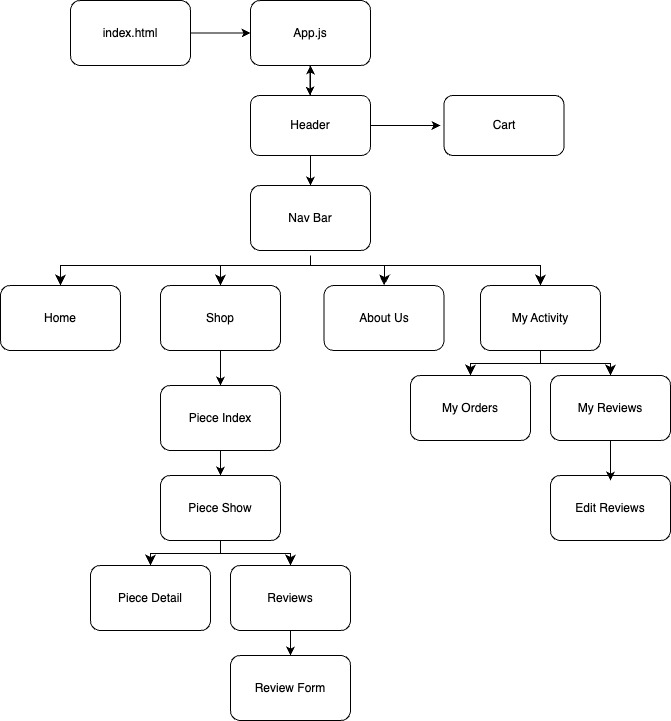

# eCommerce-Site - Beaded Jewelry

  

This repository has been created to support the proposal of a jewelry e-commerce website application.  The application backend will contain a database of inventory, customer reviews of pieces, and customer jewelry orders.  The frontend will provide an aesthetically pleasing user interface to learn about the business, browse jewelry offerings, place orders, and write merchandise reviews.    

## Entity-Relationship Diagram (ERD)
<a href = "https://app.diagrams.net/#G12sR5_SzVnqOBcclAwB9JxbeOC4ySpZbi">ERD</a>  

## Wireframe
<a href = "https://app.diagrams.net/#G1THv-YbN8E5_gIDkXwBbu4hcFI-asPGP-">Wireframe</a>  

 &ensp;  &ensp; 

 &ensp; 

## Component Hierarchy Diagram
<a href = "https://app.diagrams.net/#G1YPYlsIeKmRvpO8ynm7FZgtV4EG-Rqylj">Component Hierarchy Diagram</a>  

## Technologies
The jewelry e-commerce site will be a full-stack application utizilizing MongoDB, Express, React, and Node (MERN). 

## Trello Board
<a href = "https://trello.com/invite/b/BCP5JFM6/ATTI82ff533d2807444b5fbc662dae480da3C436F047/jewelry-e-commerce-app">Trello Project Management Board</a>
## Contact Creator

**Shanda Shaw** 

 &emsp;  
