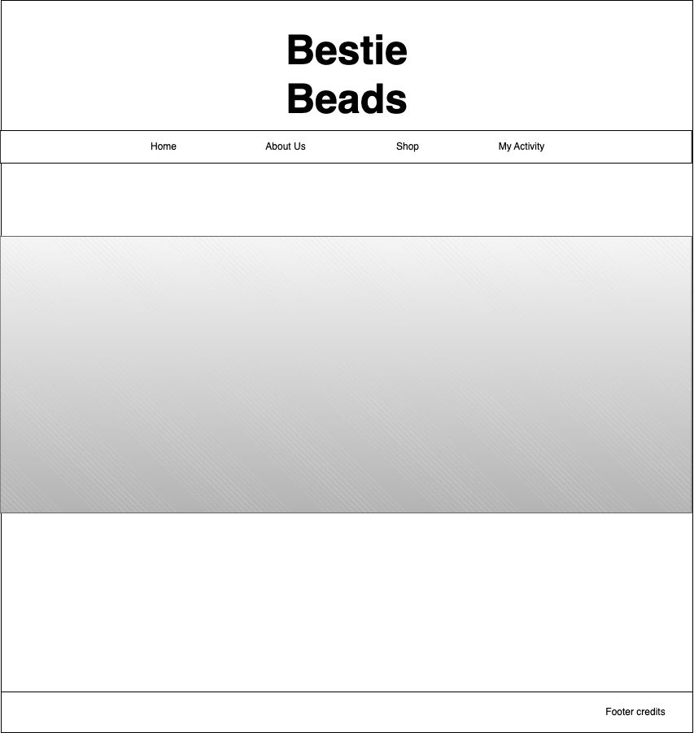
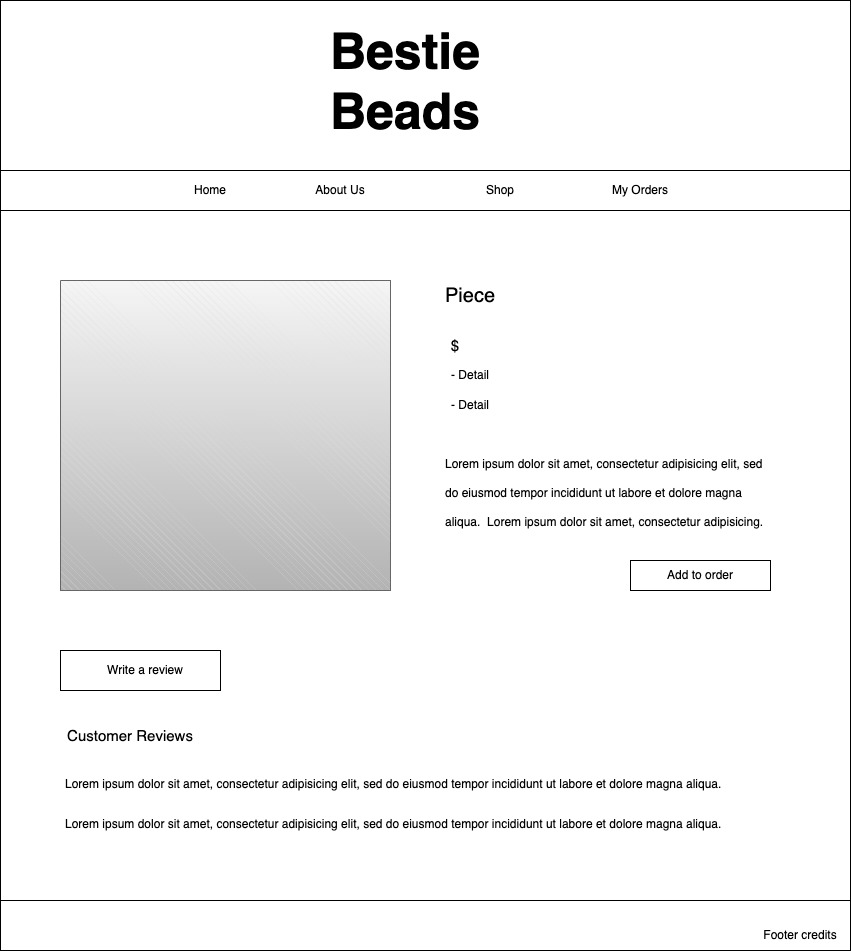
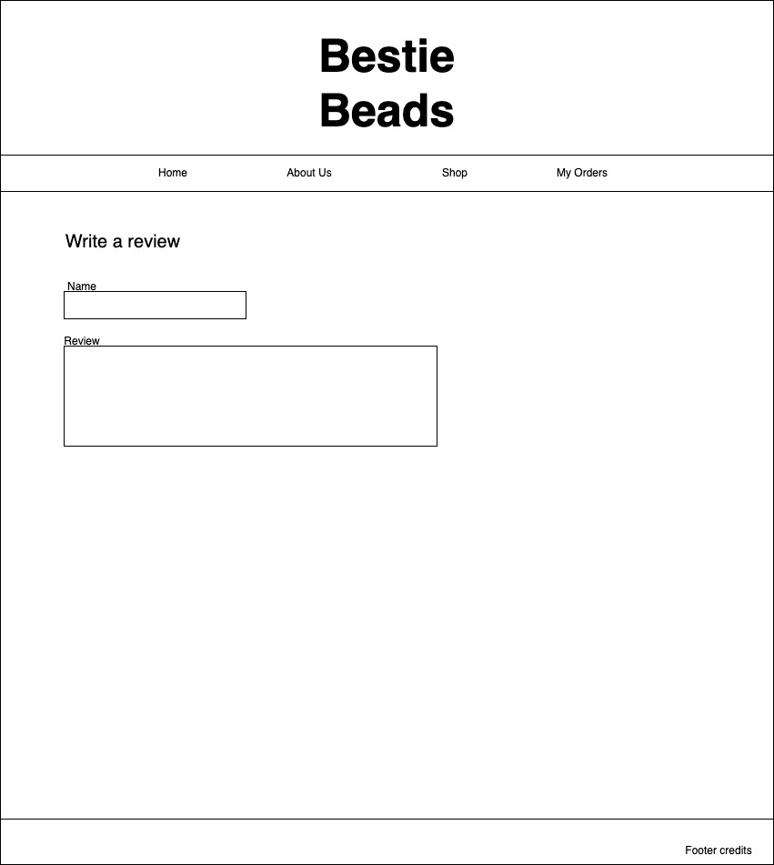

# eCommerce-Site - Bestie Beads

  

Every tween wants Bestie Beads!  And now with the launch of the Bestie Beads e-commerce website, making all of your beaded technicolor dreams come true is easier than ever!  
The Bestie Beads website is a full-stack e-commerce application that allows customers to view the Bestie Beads bracelet inventory, shop the products, and write product reviews through an engaging, user-friendly interface.

This repository has been created to support the proposal of a jewelry e-commerce website application.  The application backend will contain a database of inventory, customer reviews of pieces, and customer jewelry orders.  The frontend will provide an aesthetically pleasing user interface to learn about the business, browse jewelry offerings, place orders, and write merchandise reviews.    

## Entity-Relationship Diagram (ERD)

<a href = "https://app.diagrams.net/#G12sR5_SzVnqOBcclAwB9JxbeOC4ySpZbi">ERD</a>  

## Wireframe
<a href = "https://app.diagrams.net/#G1THv-YbN8E5_gIDkXwBbu4hcFI-asPGP-">Wireframe</a>  

 &ensp;  &ensp;  &ensp;

 &ensp; 

## Component Hierarchy Diagram
<a href = "https://app.diagrams.net/#G1YPYlsIeKmRvpO8ynm7FZgtV4EG-Rqylj">Component Hierarchy Diagram</a>  

## Technologies
The Bestie Beads application is a full-stack application utilizing MongoDB, Express, React, and Node (MERN). Additional technologies used include Mongoose, Axios, and Bootstrap.  

## Getting Started
Project tasks were recorded and managed using the Trello project management tool. 
<a href = "https://trello.com/invite/b/BCP5JFM6/ATTI82ff533d2807444b5fbc662dae480da3C436F047/jewelry-e-commerce-app">Trello Project Management Board</a>

## Explore Bestie Beads
These are just some of the features of the Bestie Beads application.   
The Bestie Beads app maintains a collection of product inventory records in MongoDB.  Bracelet information is retrieved from the backend via Axios API calls and rendered on cards with Bootstrap-based formatting. Click on a bracelet card to see more!

On the individual piece's page, the user can view details about the bracelet, add the style to their cart for purchase, or write a review for the product.  The user is assigned an ID kept in local storage.   The items added to the cart are saved in the user's local storage as well. Reviews are stored in the database.  Both reviews and cart products render dynamically by the awesome power of React hooks as changes are made.

On the user's My Activity page, they can view the orders they have created and the reviews they have written.  This data is fetched by the user's ID from the backend database and populated to the frontend components.  Here the user may edit their reviews by either updating or deleting them in the database.

Visit the site and explore more for yourself! 

## Future Updates
Look out for planned improvements to Bestie Beads including:
* Login/User profiles
* Star review ratings
* Payment system integration

## Contact Creator
**Shanda Shaw** 

 &emsp;  
